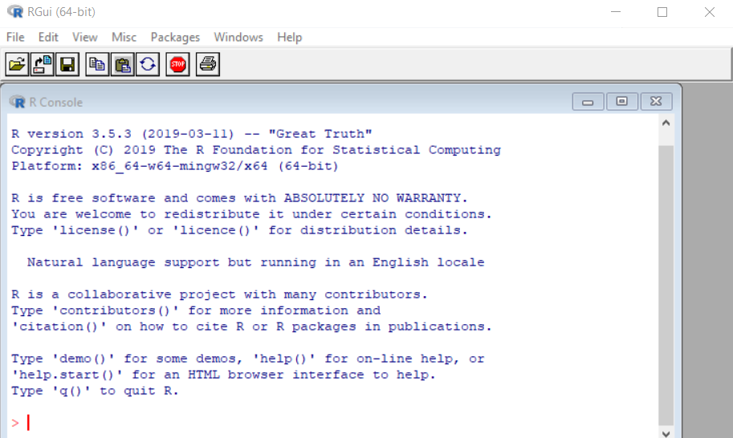

```{r setup, include=FALSE}
knitr::opts_chunk$set(echo = TRUE, message = FALSE, warning = FALSE, comment = "")
```


# Introduction 
An increase in complexity and scale of environmental data both from satellite and insitu observations. This means scientists are increasingly required to develop data skills needed to design reproducible workflows for the simulation, collection, organization, pocessing, analysis and presentation of the results. However, to gain that skills requires some knowledge of coding using one or more computer languages. Coding also known as scripting, makes your work explicitly described, and transparent and completely reproducible. 


## Why learn computer Programming?

The benefit of learning to program are numerous as it fosters creativity, reasoning and problem solving. Programming makes data-analysis more efficient, accurate and transparent---opens new doors for new analyses that would not be practical or possible without programming. Most experiments for instance are often carried out on computers, so programming is vital for designing, creating and implementing experiments. 

The advent in computer technology plays an important role in research, and there are many kinds of proprietary software developed specifically to deal with data analysis in research. For example most statisticians and researchers analyze their data with using proprietary software like Microsoft Excel, SPSS, SAS and many others. These kind of canned software are widely used and useful. They are generally user-friendly with graphic user interface (GUI)^[] require little or no programming knowledge, and you can complete analytic tasks in relatively small amount of time. 

Unfortunate the click-and drag interface you interact with in the GUI is a result of code hidden to user with these software. So you can only accomplish the taks based on how the software is program to do and incapable of doing some task that it was not designed for. You will sometimes find that the software is simply incapable of doing a particular kind of statistical anlysis or running a particular kind of experiment. At that juncture, it becomes apparent for researcher and scientists to learn programming, which help to solve solutions to unique and emerging research problems directly.

Learning how to program and create your own code allows *control* over every detail of analyzing data. This level of control is invaluable for creating flexible and customizable data analysis, and for being confident in the output that decision makers depends. Another advantage of learning to program worth mentioning is *time-saving*. Becoming fluent in programming enables you to handle research data in relatively short time. This is because with programming language skills, you automate most of the tasks with scripts or code, which save you copious amounts of time in analysing your data and open new way of exploring and visualizing the data you are working on. This make you understand the data in a different way.

Finally, computer programming is a valuable skill in general and may open doors in the larger workforce in this digital age.

## Learning to program
Learning programming  is a skill and requires an initial investment. It takes practice, time, and effort. There is no easy way out. There are many layers to individual programming languages, and there are many programming languages out there to learn that could be useful. Befere you begin to learn to code, it is important to recognize that the underlying skill of computer programming is problem-solving---the ability to sovle new problem yourself with computer. From the perspective of applying computer programming techniques to solve problems in science and other fields, there are three major aspects. These are:

1. Understaing the *issues* that need to be addressed
2. Understanding the *tools* available at your disposal
3. Applying the tools to solve the *problem*

In most cases people know the issues and want to solve them problems, the biggest and vital componet that is often missing are the tools. Recognize the tools is one way but understand how to use the tools to the solve the proleme is the most difficult step. This is what they call the *chicken and egg problem*. What should you learn first? Should you learn about how organize codes at the beginning or after you have learn some basic aspects of the language? Should you learn random tidbits of programming languages before learning how to apply those tidbits to solve a problem? 
This is a dilemma for most of us, because we real unsure of the base and where to start. 

The major porting of this book will deal with the *understanding the tool*--- the basic building blocks of any programming languages. Fortunate, most programming languages use the same basci concept forming the building bloacks for making all sort of programs. However, this book will specifically focus on R language. We believe that iving examples codes will make you understand the tools available to you and this has spill over effect as it will help you to:

i. understand the conceptual tools
ii. write codes to implement the tools using the specific syntax^[The formal rules of formulating the statements of a computer language] to solve the problems or address the issues you are facing.

Coding is writing a recipe for solving a problem. More specifically, it is writing the solution to a problem in a highly detailed manner that forces a computer to follow the directions to solve the problem. scientists have dubbed these code-based recipes **algorithms**^[A precise step-by-step plan for a computational procedure that begins with an input value and yield an ouput value in a finite number of steps]. Learning how to create algorithms involves first ldeterminging the problem and then converting the solution into an ordered steps that solve the problem. These ordered steps of instructions make use of the tools or building blocks of the programming language.

## Programming in R

R is an easy-to-learn programming language that has some reaaly useful feature for beginning programmer. The code is quite easy to read and it has an interactive console which you can enter your commands and see them run. R like any programming languages involves the same basic building blocks. Once you master the building block in R, you can switch to other languages with little difficulties. Because our goal is to learn how to code to analyze data and produce graphics, we will begin learning R, which is well-suited to this purpose. First, we will learn how to work with basic programming concepts in R , then we will learn how to handle and analyse data in R.

### What is R?
R is an *open source* programming language well suited for data analysis and visualization [@r]. It is a powerful language used in mathematical operations, data-processing, analysis and graphical display of data. Like other statistical software, R provides a statistical framework and terminal--based interface for users to parse commands for data ingestion, manipulation and graphics. @xia pointed out that R is a vehicle for newly developing methods of interactive data analysis. R have rapidly developed and extended its capability to a large collection of packages provided by researchers and volunteers. R can be downloaded from https://www.r-project.org and available for all thre major operating systems---Windows, Mac and Unix/Linux. 

R is an interpreted language---the expression specified in this languages executes line by line similar to other languages like python or ruby rather than compiling the source code an executable chunk as in C++. One of the power of R language is its dynamic---infers the data types of the variables based on the context. We do not need to declare variables separately. R is considered as *esoteric* because its syntax are easily understood by people from different fields.

The R programming usage has become one-stop solution to data analysis. R was created in 1993 and has evolved into a stable programming language. It has become a *de facto* standard for data analysis both in academic and industry sectors. R has its roots in the statistics community, being created by statistians for statistics. Many of its core tools are directed toward statistics. Being an open-source language, R has many advantage oover other commercial statistical platform like MATLAB, SAS and SPSS. The big rip for using R is its ecosystem of packages.


### Installing R
There is an active community of R developers which regularly releases a new version R. Each version has a name assigned to it. Except for major resease, the version of R are usually backward compatible in terms of their funcitonality. Installing R is fairly straightforward. **R** is available on most computing platform like Windows. Linux and Mac. It is highly recommended to install a pre--compiled bindary distribution for your operating system. Follow this instructions to install R

+ Go to https://cran.r-project.org/
+ Click download latest version of R for Mac or Windows. For Windows users click Base and download the installer. For Mac users select the file R-3.x.x.pkg that aligns with yur OS version.
+ After you download the installer, double-click its icon and the compiled binary executes and install R in your machine. Follow the instruction to install R in default location.

Once you have installed R, you should now have an icon on your Windows or Mac desktop labelled R. If you are using Ubuntu, in the Applications menu, you should see a new group named Programming with the application R. After the installation of R, the software is launched by Double-click the icon and you should see a window that look similar to figure \@ref(fig:fig101) popup. The default desktop layout include the *console*, which provide the interface between the software and the user, i.e., it accepts R commands typed after the prompt sign `>`.

```{r fig101, fig.cap="The graphical user interface of R", fig.align='left', out.width = "100%", echo=FALSE}

```


Let's enter some commands at the *prompt*, beggining with the following:

`print("Programming is fun!, sometimes challenging and occasionnaly frustrating")`. Make sure the text you typed inside the `print()` are either double or single quoted. Press `Enter` on your keyboard when you've finished typing the line. 
```{r}
print("Programming is fun!, sometimes challenging and occasionnaly frustrating")
```

If you have entered the text correctly, the word should appear in the console and the prompt should reappear to let you know that the console is ready to accept more commands.

The version and common packages used in  this book can be accessed by simply passing a commands `devtools::session_info()` in the console. you can also check the version of R installed in your computer with the base `version()` function

```{r , comment=""}
version
```

By default, R stores all of your R--related files in the startup folder named R. You can check the path of the current working directory with the `getwd()` function. 
```{r}
getwd()
```

Alternatively, you can create a personal working directory in which to read your files into R and also to export the files generated from processes in R. You should then define the path of the working directory using the `setwd()` function. 

```{r, eval=FALSE}
setwd("E:/bookdown/spatil_r/")
```

To see which files are in the working directory that you just defined or the default R working directory use the `list.files()` function
```{r, eval=FALSE}
list.files()
```


### What is RStudio?
You have seen that R comes with a console that allows to program interactively. However, you need to install RStudio--- an integrated development environment (IDE) for R programming. RStudio makes writing R codes easier and in a more user-friendly environment [@xia]. RStudio is a free and open-source integrated development environment (IDE) for R [@rstudio].  You must have already installed R in your machine before you install Rstudio. You can download the software from the R-studio website at this link http:/www.rstudio.com.

Rstudio work in the four operating systems---Windows, Mac, Ubuntu and Fedora. To obtain the reference infomation for citing RStudio in publication by simply typing `RStudio.version()` command  in the console.

### Basic Features of RStudio
After the installation is complete, open Rstudio and a window like the one shown in figure (Figure \@ref(fig:fig102) should open. Across the top is a standard menu bar with typicall menu items. Below the standard menu, the program is divided into different panels. The four fundamental panels in Rstudio that we will look are *editor*, *console*, *worksapce* and *plots*.

```{r fig102, fig.cap="The graphical user interface of RStudio showing the four main windows", fig.align='left', out.width = "100%", echo=FALSE}

knitr::include_graphics(path = "../images//rstudio3.png")
```

+ `source editor and data viewer`: The top left corner contains the script `editor.` This a simple text editor for writing and editing R scripts and markdown documents. Several tabs can be opened in the `editor` window at once, with each tab representing a different document. These files can be saved from the `editor` into the working directory. The `editor` window is also used to view data frame similar to Excel spreadsheet. Source `editor` is recommended in most programming work because of its efficient way to manage scripts and Rmarkdown document for reproducible work.

+ `environment (workspace)`: The top right panel contains several tabs but I introduce the **workspace** and **history** tabs. The workspace list all the objects that are currently loaded in R's memory. You can use the `ls()` function to check the list all files in the environment.You can also view the object in the workspace (environment) by clicking them or run `View()` function in console. 

+ `history` tab provides a record of the recent commands executed in the console, scripts or rmarkdown documents.

+ `R consoles`: The bottom left window is the command line widely known as console. this window is similar to console in base R. This is used to directly enter commands into R. There are only few thing you need to know to become familiar with `console`. Click in the `console` and you should see a blicking `caret`appear next to the greater than sign `>`, reffered as `prompt`. This is where you will type R'comands to executes one command at a time. For example,  in a console type the `2+3` and click enter;

```{r}
7+8
```

Once you have entered commands here, press enter to execute the command and you will get the answer `25`. The console is useful for entering single lines of code and running them. Oftentime this occurs when you are exploring or testing a certain task with a combinations of functions and objects. But because coding is all about creating scripts that automate the analytical process, you will find that very rare you use the the console but rather write the code in *script* or *markdown* files.


+ `files, plots, packages, help, and viewer`: The bottom-right window has five tabs for files, plots, package, help and viewer. The files tab allows browsing of the computers file directory. The plots tab will show recent plots and figures drawn with graphic functions in R. The packages tabl list all packages installed in R and provide tools for download new package and update packages. The help tab is an invaluable tab, it help to search for functions and see examples of how they are used. The viewer tab is like the plot tab that both are used to show recent plots and figures. However, while the plots is for static plot, the viewer is for animations and interactive plots and figures.

An important concept in R is the **current working directory**. This is the file folder that R points to by default. By default the software stores all of your R-related files in the startup folder, which is the **Document** folder. Alternatively, you can create a personal working directory in which to store  your R-related files with the `setwd()` function. This is especially important when reading in data to R. The current working directory should be set to the folder containing the data to be loaded into R. 

### Rstudio editor
You should be making use of Rstudio's text edditor to code in R. It is important to practice writing good code that are easy to read and understand what they mean. In short make sure your code is easy to read and understand what it does. This will help you understand your own code later, and help other people understand your code when shared or when they ask you for a help.

### Rmarkdown
Rstudio's text editor allows to create markdown files called *rmarkdown*. Markdown is a plain text that combine codes and text and ability to ouput different format like word, PDF and HTML format. This ability of combining text and code has made *rmarkdown* a powerful markup language in R. In general, with *rmarkdown* you can write document with titles, headings, paragraphs, insert figures, tables and equations. 

Another useful feature of **rmarkdown** document is the option to publish R projects in various file format such as HTML, Latex, PDF EPUB, Word and many others. This feature enables you to share your results with colleagues who may or may not have **R** software. The published document includes formated plain text in section, heading and paragraphs that comes with code chunk, figures and tables. 

### Use descriptive names
While programming, you will often declare and assign names of the variables. R usually will not care what name you give to any variables. But declare a descriptive name is informative because you easily remember what it contains. Therefore, its is encouraged to give names that represent the meaning of the data stored in each variable.

### Use comments
While working with R script, the hash tag `#` set a comment and tell the script to skip the line with the hash tag. In *rmarkdown*, the hash tag are used to set headings and therefore you can specify the comment with hash tage in the chunk code.
Comments are useful as they help you and other people about a particular code and what particular aspect it does. Therefore, it is always recommend to write clear and precise comments that can help you in the future when you want to understand what the code does and also can help others follows with little consultation if shared. 


### Getting Help in R
Often, we get stuck whilee doing some analysis as either we do not know the correct function to use or its syntax. Its important for anyone who is new to R to knwo the right place to look for help. There are two ways to get help in R---built in help system and online. 

#### Built in system
R has tons of tools to get you up and run with R base functions, these include

+ `help.start()` function that Start the hypertext (currently HTML) version of R's online documentation.
```{r, eval=FALSE}
?help.start()
```

+ `help()` is the primary interface to access documentation of functions and datasets. A shortcut for `help()` is the `?`
```{r, eval=FALSE}
help("metR::Adiabat")
?metR::Adiabat
```

+ `help.search()` allows for searching the help system for documentation and return those matching the searched itme. The shortcut ofr `help.search()` function is `??` 
```{r, eval=FALSE}

help.search("geom_contour")
??ggplot2::geom_abline
```

+ `demo` is an interactive platform that demonstrate certain topics provided in R packages. Typing `demo()` in the chunk or console gives the list of available topics.

```{r,eval=FALSE}
demo()
```

+ `example()` run the code and displays example of the specified topic that is available
```{r}
example("t.test")
```

#### Package documentation
Add on package in R can be accessed with different tools below;

+ `library` allow access of the documentation of a package . Note that the package must be installed in your machine to access its documentation
```{r, eval=FALSE}
library(help = "metR")
```

+ `vignette` allows to view a specific package vignette, or list the available ones. All available vignette in the local machine can be accessed by writing `vignette()`. Note that this can tak a long time
```{r, eval=FALSE}
?vignette()
```

You can list vignettes from all *attached* packages in your working directory as;
```{r, eval=FALSE}
vignette(all = FALSE)
```


And to access a vignette of a specific package, you simply type
```{r, eval=FALSE}
vignette( package = "sf")
```
You notice that the package **sf** has more than one vignette

#### Online Resources

+ **R bloggers** contains several post covering on different topics in R. This is the place you should not miss to visi if you want help on topic such as R, data analysis, data visualization, data wrangling and machine learning. You can learn more about this platform [here](www.rbloggers.com)
+ **Stack overflow** is very resourful place to obtain answers of some code or package you are facing challenges. There is high changes that some one else with similar challenges has already presented the matter and you can benefit from the answers provided. 
+ **Twitter** There is an active R commnity on Twitter comprised of experts who have dedicated their time and resources to help others. Use the hashtag [#rstats](www.twitter.com) if you are asking for help or guidance on Twitter. 
+ **Rstudio community** resemble stack overflow but differs in the sense you simply drop a questions related to Rstudio packages and services
+ **r4ds** Is an online system that promote community to learn data science using R. You can learn more about the communit [here](www)
+ **Rstudio Resources** offers learning resources like cheatsheets, webinars and blogs that deals with matter relating to R and Rstudio packages
+ **Reddit** is another platform that help you find answers to the challenges you face in R
+ **Future learn** 
+ **coursera**
**linkedIn**
+ **udemy**
+ **R weekly** provide updates about R community. You can get information of new packages, blogs, conferences, workshops, tutorials and jobs


