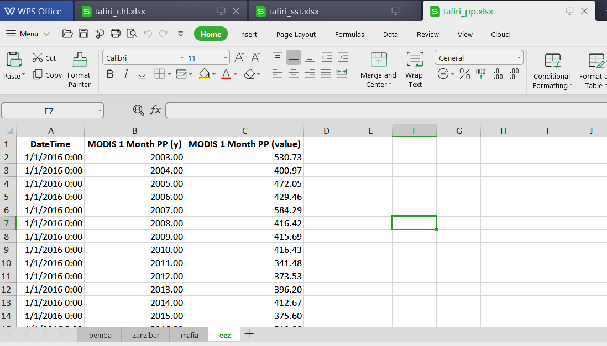

```{r setup, include=FALSE}
knitr::opts_chunk$set(echo = TRUE, warning = FALSE, message = FALSE, comment = "")


```


<!-- ```{r, echo=FALSE} -->
<!-- conflicted::conflict_prefer("filter", "dplyr") -->
<!-- conflicted::conflict_prefer("select", "dplyr") -->
<!-- ``` -->


```{r, echo=FALSE}

source("d:/semba/myblog/R/semba_functions.R")

```


One of the prime purposes of using a computer is to automate a task that would be very tedious to perform by hand. The usual implication is that some task is to be performed over and over again in some systematic way. This chapter will be concerned with the programming concept of a control flow, a feature that is at the heart of nearly every computer algorithm. The two important control flows statements are* count-controlled* loops like `for` loops and *conditional* statements such as `if-else` construct. In this chapter, you'll learn how to use `if` statements and `for` loop to automate programming processes.

```{r}
require(magrittr)
require(tidyverse)
```


## for loop

There are often operations where you know ahead of time exactly how many times an operation must be performed before stopping the loop. For example, if we have an array with 365 matrix representing a daily sea surface temperature and we want to convert it to data frame. Doing it one after the other is tedious. Fortunately, computers have some way to move from point 1 (convert the matrix to data frame) to point 2 (convert the second matrix to data frame the analysis) and so on. In R, and nearly all other programming languages, this type of operation is performed by a `for()` loop. The `for` loop, tell the computer to iterate---repeat a set of instructions times the defined number. 

In R, the basic style of `for` loop is in this form;

```{r, eval=FALSE}

for (i in 1:20){
  DO THE DO
  
}

```

Every `for` loop in R has four parts. The first is a `variable` (in this case, `i`) that will be used to keep track of the number of times through the loop. The second is the `index` the variable `i` will take on as it repeats. In our example, `i` will start by taking the value 1, then 2, then 3 and so on until reaching 20. Third is to place a bound on what will be looped over, denoted in R by the braces `{}`. Fourth are the commands that will be executed (there can be as many as needed) within the `{}` lines. Note that this is a good example of using indentation to make clear where the loop starts and ends, as well as the commands to be executed. 

To better understand how loops work, let's iterate  the sentense `R for data analysis` five times.

```{r}

for (i in 1:5)
  
  print("R for data analysis")

```

We can create vector of monthly temperature numeric values and and month labels. We then display the temperature value for each months with its corresponding month name. THe code can be written as:
```{r}

temperature = c(28.6,28.8,29,28,27.8,27.2,26.8,25,26.2,27.2,27.5,27.8)
months = c("Jan", "Feb", "Mar", "Apr", "May", "Jun",
           "Jul", "Aug", "Sep", "Oct", "Nov", "Dec")

for (j in 1:length(temperature)){
  print(temperature[j])
  print(months[j])
}

```

In this code, the variable `temperature` and `months` will start at a value of 1. Then the loop will begin with i = 1. On the first pass through the loop,  will be increased by 1 (e.g., x = 2). On the second pass through the
loop, (i = 2) x will be increased again by 1, e.g., x = 3, and so on until i = 5.

```{r}

temperature.anomaly = NULL

for (j in 1:length(temperature)){
  temperature.anomaly[j] =  temperature[j]-mean(temperature)
}
temperature.anomaly
```

Note that like conditional statements, loops comprising two or more lines or statements requires braces.

```{r}
for (j in seq(1,12,2)){
  print(temperature[j])
  print(months[j])
}
```

Often times you may encounter a situation where you need to allocate an empty object that will store the output of growing data. An empty object will provide space to store the output from each `for` loop. A more efficient practise is to initiate a list object that is empty then fill it with the output from each iteration. For example in the chunk below we create an empty list object called `my.data` and then initiate a for loop with and index `for (i in 1:length(temperature)`, which count the month. Then within the for loop the body `my.data[[i]]= data.frame(month = months[i], temperature = temperature[i],temperature.anomaly = temperature[i] - mean(temperature))`. The body create a data frame of three columns---month, temperature and temperature anomaly for each month and store them in the list object `my.data`. Once the list is filled, we unlist `dplyr::bind_rows(my.data)`using the `bind_rows()` function from **dplyr** package [@dplyr;@tidyverse].


```{r}
my.data = list()

for (i in 1:length(temperature)){
  
  my.data[[i]]= data.frame(month = months[i], 
                     temperature = temperature[i],
                     temperature.anomaly = temperature[i] - mean(temperature))
  
  }
dplyr::bind_rows(my.data)

```

### For loop on array

Often times we receive array data with several matrix embbeded and you may be reguired to convert the array into other format---prefarably data frame so that you can have full control of data processing and visualization. Let's load an array of sea surface temperature from the working directory with `load()` function. 

```{r}

load("../data/modis_pemba.RData")
```

Exploring further the dataset, we notice that its an array with 35 longitude spacing and 7 latitude spacing and 54  matrix collected every month from `r sst$time[1] %>% as.Date` to `r sst$time[196] %>% as.Date`. Being an array, this dataset is not in the right format, since **ggplot2** only accept the data frame format. 

```{r}
sst$data %>% class();sst$data %>% dim()

```

We can inspect the longitude of the array
```{r}
sst$longitude
```

We can also inspect the latitude of the array
```{r}
sst$latitude
```

We can also check the first matrix of the array
```{r}
 sst$data[,,1]
```


Therefore, we need to tidy this dataset from the array into the data frame. We can iterate the conversion with a `for` loop in the chunk below. Note that the `matrix_tb()` function used in this loop to convert matrix along with longitude and latitude to data frame I created to help process the data. You can found this code for this function [here](www.www.ww)

```{r}

## preallocate object as a list()
sst.tb = list()

## loop sst
for (i in 1:length(sst$time)){
  
  sst.tb[[i]] = matrix_tb(x = sst$longitude, 
                          y = sst$latitude, 
                          data = sst$data[,,i]) %>% 
    mutate(time = sst$time[i] %>%as.Date()) %>%  
    dplyr::select(date = time,lon = x, lat = y, sst = value) 
}

## unlist the listed sst and chl files
sst.tb = sst.tb %>% bind_rows(sst.tb)

sst.tb %>% sample_n(size = 8)

```
Here a list object is created before the loop that will store data frame converted from matrix embedded in an array.  Note that, in this case, the variable `i` is playing two roles. It is the loop variable, but it is also the index to the list object. This is one of the most powerful aspects of having a loop variable. 


NESTED LOOPS
Loops are assigned a variable for two purposes.The first is so that the variable can be used to perform some useful function, e.g., as an index to an array or matrix. The second is because loops may exist within other loops, and we need variables to make it clear where in the iteration sequence we are. 

```{r, eval=FALSE}

for (i in 1:N){
  for (j in 1:M){
    COMMANDS HERE
	}
}

```

The nested loop can be illustrated with the chunk below. In my working directory I have three Excel spreadsheet files containing the monthly average of chlorophyll-a, primary productivity and sea surface temperature.

```{r}
tafiri = dir(pattern = "../tafiri_")
tafiri
```

 Each file has four sheets containing values from four different sites: Pemba, Zanzibar and Mafia Channels and Exclusive Economic Zone. 
```{r}

```
 
Our task is to automate the process and instruct computer to do two task. First is to read each file from the working directory. The second task is to process the the data from each sheet in the file and tidy the variable in the right order. The later processs involves three steps. First is to assign the variables with appropriate names. The second is to mutate the new variables: month, day site, variables for each sheet and arrange them appropriate. The third process stitch the processed data frame below the former one. 

In simple language I can explain this code as. The `var` and `sites` were created to correspond the order of files in the directory and sites in each file sheet, respectively. Because once each sheet is procesed is stitched, I created and `tafiri.data` as an empty object to store the files. Once these three files are created, it is ready to iterate the process. The loop goes like this: the `i` is set to 1 (which is chl) to read the first file, then `j` set to sheet in each site, which is looped from 1 (Pemba channel) to 4 (EEZ). Then `i` is set to 2 (pp) and `j` is again looped from 1 (Pemba) to 4 (EEZ) and so on until `i` = 3 (SST). A sample of the dataset is shown in table \@ref(tab:tab99) 


```{r, eval=FALSE}
## make a vector of variables. The order must be consistency with the files order in 
var = c("chl", "pp", "sst")
## make a vector of site. The order must be consistency with the sheets in files
sites = c("Pemba", "Zanzibar", "Mafia", "EEZ")

## preallocate an empty object

tafiri.data = list()

for (i in 1:length(var)){
  for (j in 1:length(sites)){
    
  tafiri.data[[i]] = readxl::read_excel(path = tafiri[i], sheet = j)%>% 
  rename(date = 1, year = 2, value = 3) %>% 
  mutate(month = lubridate::month(date), 
         day = 15,
         site = sites[j], 
         variable = var[i],
         date = lubridate::make_date(year = year, month = month, day = day)) %>%
  arrange(date)
    
## stitch processed data frame from each sheet    
tafiri.data = tafiri.data %>% 
  bind_rows(data)
 
  }
}

```

Note that when use `i` and `j` variable in a for loop, it's better to create an empty object with `NULL` instead of  list files with a`list() function

```{r tab99, echo=FALSE, eval=FALSE}
tafiri.data %>% sample_n(10)%>%
  select(site, date,day, month, year, variable, value)%>%
  kableExtra::kable(caption = "Sample of the tafiri dataset", col.names = c("Site", "Date", "Day", "Month" , "Year", "Variable" , "Value"), digits = 2, align = "c") %>%
  kableExtra::column_spec(column = 1:7, width = "2cm") 
```


## if and else statement
The second important staments to control the flow of script are `if-else` constructs, which evaluate an expression and then execute a group of instructions if the expression is true. Conditions can be more complicated than a single question, and `if` statements can also be combined with multiple questions and different responses based on the answer to each questions. As an example, we might ask, "Is the surface temperature higher than 26 degreee celcius? and if the answer is `yes`, respond with *that is ideal*. An `if-else` statement like this might be writen in R like this:

```{r}

optimal = 25
measured = 21

if (measured < optimal){
  print("temperature is ideal")
  }else{
    print("Temperature is not ideal")
  }
  

```

An `if-else` stamement in the chunk above first evaluates whether the measured temperature is less than optimaland. If the evaluation is **YES** or **TRUE**, the   `temperature is ideal` is displayed. If the answer is **NO**, the `else` command, which provides an alternative statement precede and display `Temperatue is not ideal`.


We can also nest as many `if-else` statements in a one block of code 
```{r}
optimal = 25
measured = 30.2

if (measured < optimal){
  print("temperature is ideal")
  }else if( measured > 25 & measured <= 26.5){
    print("Temperature is ideal but a bit higher")
  }else if(measured >26.5 & measured < 30){
    print("Temperature is not ideal")
  }else{
    print("Avoid it at all cost")
  }
```


Once we know the basic principal of `for` loop and `if-else` statment, we can combine them to answer a identify months with ideal temperature versus those with unsuitbale temperature.The combined statement can be written as:

```{r}
temperature = c(28.6,28.8,29,28,27.8,27.2,26.8,25,26.2,27.2,27.5,27.8)
months = c("Jan", "Feb", "Mar", "Apr", "May", "Jun",
           "Jul", "Aug", "Sep", "Oct", "Nov", "Dec")
ideal = 27

for (i in 1:length(temperature)){
  if (temperature[i] < 27){
    print(paste("Temperature for ",months[i], "is ideal"))
  } else{
    print(paste("Temperature for ",months[i], "is not ideal"))
  }
}
```

```{r}

for (i in 1:length(temperature)){
if (temperature[i] < ideal){
  print(paste("Temperature for",months[i]," is ideal"))
  }else if( temperature[i] > 25 & temperature[i] <= 26.5){
    print(paste("Temperature for",months[i],"is ideal but a bit higher"))
  }else if(temperature[i] >26.5 & temperature[i] < 30){
    print(paste("Temperature for",months[i],"is not ideal"))
  }else{
    print(paste("Temperature for",months[i],"avoid it at all cost"))
  }
}
```


```{r, echo=FALSE, eval=FALSE}

aa = dplyr::bind_rows(my.data)

aa %>% 
  mutate(decision = if_else(temperature.anomaly < 0, "Negative", "Positive"))

```

## Functions
In R, functions are treaed as first--class objects similar to other data types like numeric, character or vector. This is the fundamental property of *functional programming* languages. 

### core functions
R provides functions for common tasks like plotting, statistics and numerical analysis. In practice, most of the interactions we have with R is through functions---either provided by the base system or in packages.

The syntax for calling a function in R is similar to most other programming languages. FOr instance, we use the function `mean()` to compute the average of a vector of numbers. This function is provided by the base package
```{r}
temperature = c(28.6,28.8,29,28,27.8,27.2,26.8,25,26.2,27.2,27.5,27.8)
mean(temperature)
```


Sometimes you might need to extend some function that are neither offered by base nor by other packages. Then you need to define your own function to perform a particular task.  For instance, we need to log--transform climatological monthly sea surface height anomaly. Let's first create ana imaginary ssh anomaly
```{r}
ssh.anomaly = c(1.2,1.1,0.8,0.2,0,-0.1,-0.52,-0.4,0.12,0.58,0.89, 1.02)
log(ssh.anomaly)
```

We notice that `log()` function returns `NaN` for negative elements and `Inf` for zeros. only positive elements returned with numeric values. From the results above, it is clear that `log()` function never works with negative and zeros. Therefore, for this kind of data like the ssh anomaly where numeric values ranges from negative to positive with some instance of zeros, another function for transofrmation is needed. Unfortunately there is none at present from R. That's when creating your own functions matters.

### user defined functions
R has a special syntax for defining functions. Like other programming languages, R offers a `function()` sysntax that allows to speficy the function name, parameters along with body of statements that executes and produce results and a  `return()` funtion to output the result. The syntax for defining function is similar to that of creating objects, using the assignment operator either `<-` or `=` depending on your preference. For instance,  We create a function and assign it a name `inverse_hyperbolic`, which transform data close to logged but allows for zeros and negative, which log() function returns infinity and NaN, respectively.

```{r}

inverse_hyperbolic = function(x = "a numeric, a data frame or matrix"){
    output = log(x + sqrt(x^2 + 1))
  return(output)
  
}
```


It's not necessary to specify the return value in function. The principal is that the last item evaluated in the function is automatically considered as the return value. However, we defined the `return()` for `inverse_hyperbolic` functionw to print out the result. 

Using the function we created is very simple, for instance we can tranform the ssh anaomaly with the function we just created as highlighted in the chunk below;
```{r}
ssh.anomaly.transofrm = inverse_hyperbolic(ssh.anomaly)
ssh.anomaly.transofrm
```

The literal name of our function `inverse-hyperbolic`, corresponds to the function object, while the `ssh.anomaly.transofrm` is the result of the call returned by the input `ssh.anomaly` after evaluated with `inverse_hypperbolic()` function.


We can also create a function that repeate common task

```{r}
## This function convert matrix into a data frame that is suibtable for tidyverse ecosystem.
##
matrix_tb <- function(x="supply the vector containing the the x value of the array",
                      y = " supply the vector containing the y value of the array",
                      data = "supply the the matrix from the array"){

  if(!is.matrix(data)){
    stop("you supplied unsupported file, only matrix format file is acceptable")
  }else{


  require(magrittr)
  require(tidyverse)  

  dimension <- data.frame(x, data) %>% dim()

  output <- data.frame(x, data) %>%
    tidyr::gather(key = "lati", value = "value",2:dimension[2]) %>%
    dplyr::mutate(y = rep(y, each = dimension[1])) %>%
    dplyr::select(x,y, value) %>%
    tibble::as_tibble()

  return(output)
  }
}
```


## packages

In R packages refers to a collection of functions bundled together. In addition to functions, an R package can also contain datasets along with the dependincies. When you start R, the base packages is loaded also by default. The base packages contain basic functions for arithmetic, importing and exporting of dataset, plotting and numerous other simple tasks. 

In additon to base packages, there are thousands of packages avaialble in the CRAN covering. We can install these packages from R using the `install.packages()` function---which downloads the sources files for the packages from CRAN mirror websites and store the package in a local repository. 

We neeed to call `install.packages()` once to install the package(s). Once the package is installed, we use either `library()` or `require()` to load the functions into the workspace. We use several packages in this book and load them with the `require()` function.   

```{r}
require(EnvStats)
```

