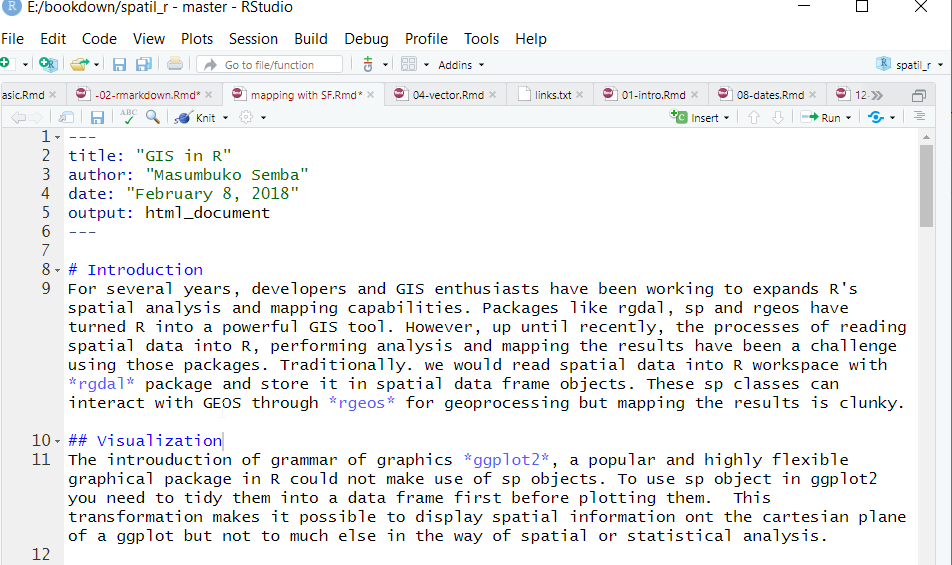
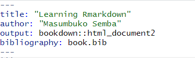
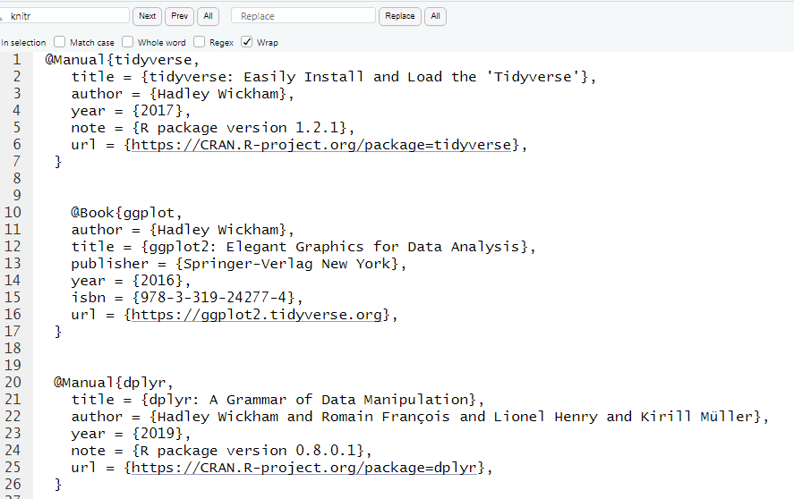
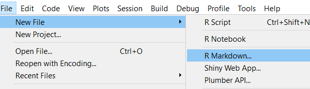
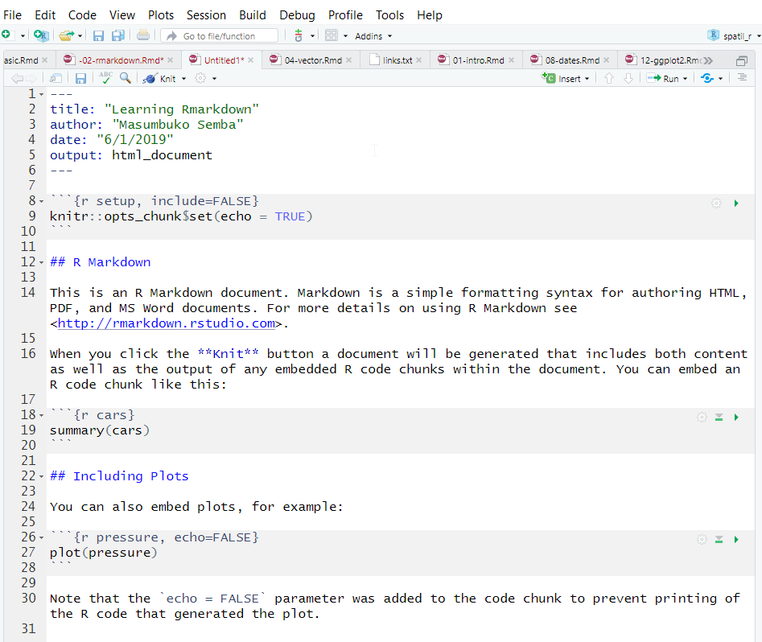
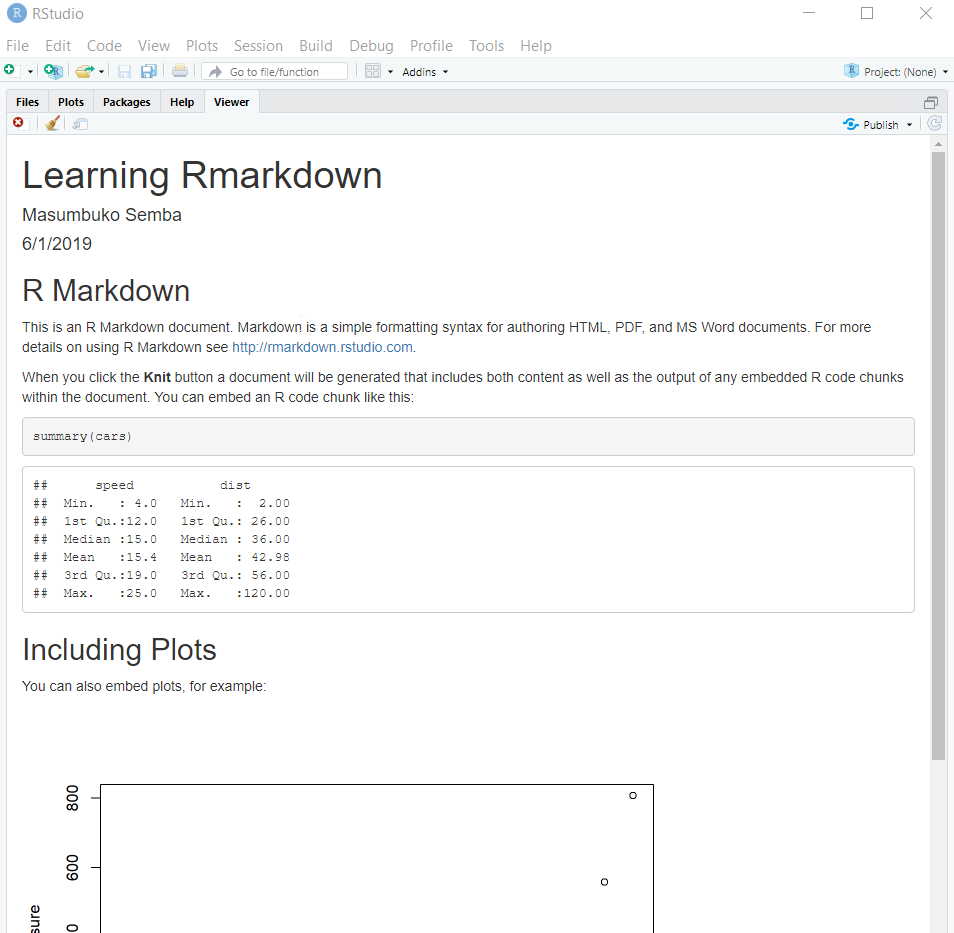
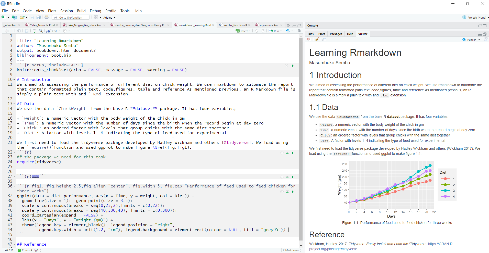

```{r setup, include=FALSE}
knitr::opts_chunk$set(echo = TRUE, warning = FALSE, message = FALSE, comment = FALSE)

require(tidyverse)

```

One of the key task of scientist is communicate your analysis and result to the different group of people.
The typical data analysis workflow looks like this: you go out and collect data and you organize it in a file or spreadsheet or database. Then interact with R using scripts to run some analyses, perhaps saving some intermediate results along the way or maybe always working on the raw data. You visualize and create some plots or tables of relevant summaries of the data. And then you go and write a report about the results in a text editor or word processor and fine tune report or document. To accomplish these task you must use various tools. 

That era has gone and in R there are several ways of writing documents that are used both as automated analysis scripts as well as for generating reports. The most popular of these approaches is **R Markdown**---for writing these documents) and **knitr**---or running the analysis and generating the reports. The two packages can generate report that has code, results, plots and text in various format. This chapter introduces R Markdown, a simple programming syntax that can be used to describe text formatting and structure by adding special characters to the text. Being comfortable with this simple syntax to describe text rendering will help you document your code. 


## R Markdown
In interactive data analysis, the code and not the report or presentation that is the source of the results. Therefore, the document should also be based on code. This can be accomplished with R Markdown, which produces documents that are generated by code, reproducible and easy to maintain. R Markdown is a file format for easy--to--write dynamic documents from plain text. It provide a unified authoring framework---combining code alongside its outputs (graphs, tables, etc), with comment that explain about the code. R Markdown documents are fully reproducible and rendered in several output documents---Html, PDF, Word files; presentation--- Html slideshows, PDF beamer and MS powerpoints, and more. 

R Markdown documents uses the **Markdown** package, which also depends on  markdown syntax. Markdown is a very simple `markup` language which provides syntax that is used to describe the format and structure of text documents. With only a small handful of options, Markdown allows you to apply formatting to your text and creating documents with headers, images, links  and more while maintaining the original plain text easy to read. 

R Markdown is easy to use, allows others to reproduce your work and has powerful features like producing multiple output formats. With R Markdown, you can spend more time workin on your code and less time maintaining and typeseting the report---this translate that with R Markdown you can share more work with less effort than used before with previous tools. This is one powerful of using R Markwons as it make scientists more effective. 

An R mMrkdown documents essentially servers three purpose---communication, collaboration, and modern--day lab environment, which captures what you did and what you were thinking. From a communication angle it enables decision makers focus more on the results of the analysis insted of lines of code. But, because it include the code, it serve as a means to share and collaborate your work with others. 

To work with **rmarkdown** in **Rstudio**, you need the latest version of R and Rstudio. You also need **rmarkdown** and **knitr** packages installed in your machine. If you have not installed them in your machine, you can install the packages using the code written as;

```{r, eval=FALSE}

install.packages("knitr")
install.packages("rmarkdown")

```

You do not need to load the two packages, because Rstudio explicitly does that automatically when needed. The output format of an R Markdown files is a plain text file with an extension of `.Rmd`. This file contain a mixutre of three types of content including a YAML header, R code and plain text mixed with text formatting as shown in figure \@ref(fig:mark-fig1). 

```{r mark-fig1, echo=FALSE,  fig.cap="Rmarkdonw syntax"}



```

## Text Formating
As we mentioned previously, R Markdonw is based on the Markdown syntax. Markdown is used to declare text formatting options. You do this by adding special symbols (punctuation) around the text you wish to “mark.”You can see some of the **Markdown** syntax tha **rmarkdown** use to format plain text shown in table \@ref(tab:tab0299).  

First, there are section header. You can specify differen level of headings---chapters, sections, subsections etc with the hash tag (`#`) at the begining of the heading. To have unorderlist, you use an asterisk at the begining and a space before the text. You can have sublist by simply indenting the asterisks. You ought to tab the indented line so there is a space between where the text start and the outer lever and where the bullet is at the next level. If you prefer, you can use the dash `(-)` instead of `(*)`.  To have numbered list you simply use the numbers instad of the `*`. Never mind even if you mix the number, pandoc will handle that and arrange the number in ascending order.

```{r tab0299, echo=FALSE}


data.frame(Syntax = c("#heading1","##heading2","###heading3","* text *", "** text**", "`code`", "~~ text ~~", "+ text", "1. text", "> text", "---text", "--text", "2^", "x^", "x_"), 
           Format = c("single hash tag for First level Heading","Two hash tags for second level Heading","Three hash tages for third level Heading","Emphasize *italize* using asterisks", "Emphasize bold with two asteriks", "`Code` text with back ticks", "strike through with two tilde", "Ordered list", "Numbered list", "Quote", "Em dash with three dash", "En dash with two dash", " Power with ^ symbol", "Superscript with single ^", "Underscript with Underscore")) %>%
  kableExtra::kable(format = "html", caption = "Common syntax for Markdown formatting", align = "l") %>%
  kableExtra::column_spec(column = 1, width = "4cm")%>%
  kableExtra::column_spec(column = 2, width = "8cm")
  
```


## Hyperlinks
R Markdown Providing hyperlinks in documentation is a great way to reference other resources on the web. You turn text into a hyperlink in Markdown by surrounding the text in square brackets `[]`, and placing the URL to link to immediately after that in parentheses `()`. For example `[here](www.masumbuko-semba.netlify.com/2018-02-25/sst/)`

## Images
R Markdown also supports the rendering of images in your documents, which allows you to include diagrams, charts, and pictures in your documentation. The syntax for including images is similar to that for hyperlinks, except with an exclamation point ! before the link to indicate that it should be shown as an image: `[!picture](path/toimage)`.

## Tables
While syntax for tables isn’t supported in all Markdown environments, tables can be shown on GitHub and in many other rendering engines. Tables are useful for organizing content, though they are somewhat verbose to express in markup syntax. Its complex to create table with the Markdown syntax, however, you can use either `knitr::kable()` or `kableExtra::kable()` to render data frames into Markdown table. This tools also has function to customize the table for generating as Html or *Latex* PDF document. Later on, I will show you how to make table from data frame with `kableExtra::kable()`


## Cross-referencing
Markdown and R Markdown do not support cross references and citation. However, you can combine R Markdown with bookdown package to achieve that. As shown in figure \@ref(fig:mark-98), I added the bookdown::html_document2 in the YAML (Figure \@ref(fig:yaml)) header to let bookdown function of cross-reference possible in R Markdown document.  

```{r yaml, fig.cap="Formatted YAML header to accomodate cross-reference and bibliograpy"}

```


## Bibliographies
You notice also that I added the `bibliography: book.bib` in the YAML header of the R Markdown document. This handle citation and allows the writer to insert citation. To make the citation done automatically, you must have listed your file in Biblex format (.bib) as shown in figure \@ref(fig:bib) as I did here and call the index with the key. To add a bibliography, you simply add the `bibliography::name ` to YAML header as shown in figure \@ref(fig:yaml). The `name` should be the file name of the Bibtex, and the Bibtex file should have an `.bib` extension. 

```{r bib, fig.cap="Formating reference in Bibtex format"}

```

To cite an article from the bibliography, you use `[@dplyr]` where dplyr is the indentifier key used in the Bibtex document of the list of reference.  You can cite more than one paper inside the square brackets separate by a semicolon [@dplyr; @tidyverse; @ggplo]. To supress the author name(s) in the ciatio, say whey you have mentioned the names already of the reference in the text, you put - before the @, so you write Hadley Wickham -@ggplot the author of..... Depending on the journal or the citation style you prefer the most, you can specify the style of citation by adding `csl: *` tag in the YAML header, where `*` stands for the citation style, for instance, `plos_one.csl`.

## Create .Rmd FIle
To create a new R Markdown document, first open Rstudio and go to the `File menu`, choose `New File` and then `R Markdown`. 
 

```{r, echo=FALSE}


```

Now RStudio will bring up a window where you can decide which kind of document you want to make and add some information, such as title and author name. It doesn’t matter so much what you do here; you can change it later.  Rstudio will always choose `html` as the desired output document format . Type the `title` and `author name`, then click OK.

```{r, echo=FALSE}
knitr::include_graphics("./images/rmarkdown2.png")

```

The result is a new file with some boilerplate text in it, as shown in Figure 2-1. At the top of the file, between two lines containing just --- is some meta-information for the document, and after the second --- is the actual text. It consists of a mix of text, formatted in the Markdown language, and R code. Save the file go to the `File menu`, choose `Save As` and choose the name of the file you want to save in your working directory. The file should have and R Markdonw (`.Rmd`) extension.    

```{r, echo=FALSE}


```

## Rendering Markdown
To render R Markdonw document in Rstudio, you use the  **knitr** package---a General-Purpose Package for Dynamic Report Generation in R [@knitr]. In the toolbar above below the standard menu bar, there is a menu option called  `Knit`, clikc the arrow pointing down just after the `Knit` and click `Knit to HTML`. The knitr package will render the R Markdown document into an HTML document and open it in Rstudio' viewer pane as shwon in figure \@ref(fig:mark-compiled).

```{r mark-compiled, fig.cap="Rendered Markdown file as HTML" }

```

The rendered HTML file is also saved in your local directory bearing a same name to that given to R Markdown document. 


## Structure of an Rmarkdown FIle
The `.Rmd` file has three main parts

+ **Header**: The text at the top of the document, written in *YAML* format.
+ **Markdown sections**: plain text that describe the workflow written using the markdown syntax
+ **Code chunks**: block of `R` code that can be runa and also be rendered using `knitr` to generate an interactive output of your desire.

## Inserting code chunk
To execute command in `.Rmd` document, you need to insert a chunk. You can insert these code block for R commands in three ways

1. Using the combination of keyboard shortcuts `Cmd|Ctrl + Alt + I`
2. You can insert with the button icon in the editor toolbar
3. You can manually insert the chunk by typing three back ticks followed with r inside the braces` ```{r}` and finish with three back ticks ` ``` `

> You choose the approach that you feel comfortable, but I recommend to  learn the keyboard shortcut, which will save you a lot of time in the long run and serve you from fatique. 

## Chunk name

## Chunk options
rmarkdon has several options that help you control how the R commands are executed in chunk block. There are almost sixty options offered by **Knitr** for you to control the code chunks. Some of the most commonly used options includes;

+ `eval = FALSE`: prevents code from execution. And since the code will not run, you expect no result. This is important especially when you want to highlight the function of certain commands, but they should not run
+ `include = FALSE`: allows the code to run but should not show the code results in the final document. There process that alwys output message or notification, use this option to prevent them
+ `echo =  FALSE`: This options run the code and display the result but prevent the code from appearing in the document. This is useful for writing document intended to people who have no interest of seeing the underlying R code
+ `message = FALSE`: or `warning = FALSE` prevent both the message and the warning from appearing in the final document.
+ `results = "hide"` hides printed outputs
+ `fig.show = "hide"` hides plots
+  `error = TRUE` allows the rendering of the document to continue in the next code chunk even if there is an error in the code chunk being evaluated. 

## Inline code
You can insert R code chunk directly in the text by surrounding the code with a pair of backticks and the letter `r` like ` `r` `. This simply means you typle a single back tick ` `r ` with a letter `r` without the brace blacket and followed by a sing back tick. Inline code are useful especially when you want to R code executed but only display the properties you examined in the text. 

To sum up, figure \@ref(fig:mark-98) display the raw R Markdown document with the formatted text, code, and syntax on (left panel) and the generated HTML document, which is clean and nice for reporting. 

```{r mark-98, fig.cap="A R Mardown document (left) and rendered HTML document (R)"}

```


