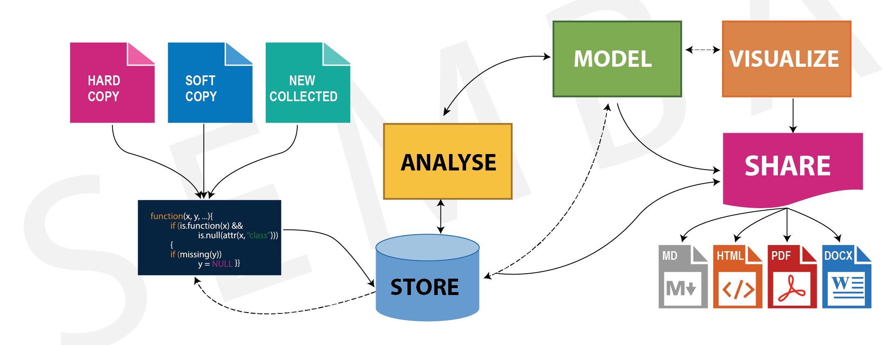

# Overview
By far the most popular software for processing data is the Microsoft Excel spreadsheet software (http://office.microsoft.com/excel). Following its first introduction for Macs in the mid-80s, and later for Microsoft Windows, the software has seen multiple modifications and improvements before being included in the Microsoft Office suite, which also contains Microsoft Word and Microsoft PowerPoint (http://office.microsoft.com). A free open-source alternative to Excel is Calc included in the cross-platform OpenOffice suite that also contains Writer and Impress (http://openoffice.org). The more advanced, but also more expensive alternative to Excel is the popular SPSS software package (https://www.ibm.com/products/spss-statistics).

Spreadsheet software packages are, however, generally very limited in their ability to process large data sets, such as those for digital elevation models or images. For such data sets, various high-level programming languages integrated into software environments, either GUI-based or solely command-line based (or both), are very popular tools for processing scientific information. The cross-platform Python (http://python.org), first introduced in 1991, is free and command-line based, but with graphics output using Matplotlib Graphics (http://matplotlib.sourceforge. net).

The programming language R, which was first introduced in 1993, is probably the most popular member of this family of tools (http://r-project.org), and is also free. R is a high-level computing language and interactive environment for algorithm development, data visualization, data analysis, numeric computation and reporting. R is a powerful platform for data handling, data analysis and capable of creating almost any type of graph. Simply stated, it is a tool that works well, and fits comfortably in the hand. 

The alternative to R and Python but also expensive is the  cross-platform MATLAB,whose original goes back to the late 1970s, is particularly popular in physics, including astronomy and medical imaging. MATLAB was primarily designed for numerical computations. Both Python and R are popular in more diverse fields, which means that users of these languages can benefit from the efforts of broad communities of experts. The popularity of R and Python lies partly in the technical merits of the languages, and partly in their open-source licenses. 

During the last few years R has become an increasingly popular tool in research and academia. It has been used for finite element modeling, processing of data, analyzing of spatial and non-spatial data. The continuing popularity of the language is apparent in published scientific literature, and many conference presentations have also made reference to R. Universities and research institutions have recognized the need for R training for staff and students, and many earth University across the world now offer R courses to tail in solving problem facing the Society.  More universities and research institutes are embracing R and Python for statistical analyses rather than commercial software such as MATLAB, SAS, Strata, and SPSS. 


```{r, out.width="100%", echo=FALSE, fig.cap="The schematic drawing of the analytical steps in data extraction, processing, analysis, exploration, modelling, visualizing and sharing to various format"}



```

