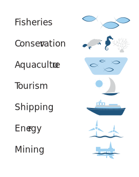

```{r setup, include=FALSE}
knitr::opts_chunk$set(echo = FALSE, eval = FALSE, warning = FALSE, message = FALSE, comment = "")


```

Marine and coastal environments form complex interdependent webs of life where organisms of all sizes interact according to intricate rules of survival. Humans are integral nodes in this web, relying on marine and coastal systems for both livelihoods and recreation in a co-dependent relationship that requires the environment to remain healthy and vibrant.




How can we manage such complex ecosystems in a way that integrates ecological, social, and economic goals?  According to  
[UNESCO](), we need to use Marine Spatial Planning (MSP). Marine Spatial Planning (MSP) is a public process of analyzing and allocating the spatial and temporal distribution of human activities in marine areas to achieve ecological, economic and social objectives that have been specified through a political process. 

The MSP is a comprehensive, adaptive, integrated, ecosystem-based, and transparent spatial planning process, based on sound science, for analyzing current and anticipated uses of ocean, coastal, and Great Lakes areas.” By planning for specific uses of these resources, we can ensure we have set aside the right areas for different uses and thereby reduce user conflicts and environmental impacts.  MSP is geared to preserve ecosystem functions so that economies, societies and the natural environment are balanced with one another into the future.

Recognise Agenda 2030 which defines the Sustainable Development Goals (SDG), in particular SDG 14 and the Blue Economy, Vice President Office's in collaboration with WWF Tanzania, convened a first-ever National Stakeholder Meeting  on Marine Spatial Planning (MSP) to foster, facilitate and plan for cross sector business involvement in the Tanzania MSP process. The nearly 60 Forum participants included representatives from goverment sector, private sector, academia, shipping, fisheries, marine recreation, mining, marine technology, marine law, marine environmental services, and other sectors.

The Forum was designed to review on scoping report and explore tools that suits to develop a clear understanding of MSP, define and examine the potential business impacts and benefits of MSP, ensure the business community is informed. MSP processes and plans, and identify the next steps to facilitate and coordinate business involvement in MSP.

The participants emphasized that MSP must be well-balanced, well-informed and consider socio-economic value and benefits as a key part of the process. Private sector input was clear that MSP needs to have the business community and economic actors involved throughout the process. The participants believe the combined operational, technical and scientific expertise of the diverse ocean industries should be utilized to best benefit informed MSP decisions. Such involvement must start early in the process, when government and stakeholder bodies tasked with MSP are being formed.

MSP requires the development of tools that can analyze, visualize, and update data. Interactive based tools have the potential to transform the way MSP results are communicated, giving the audience more control over the exploration of data inputs and outputs, thus permitting an engaged and detailed exploration of patterns otherwise obscured by traditional static approaches (e.g., figures, tables, and reports). The team developed a blueprint tool that serves as platform for MSP and can be found at this [link](https://lugoga.github.io/msp/). The platform used open source tools that are reproducible and shareble to the public in R environment. 

R (R Core Team 2019) has become one of the most popular programming languages used for statistical computing, graphics and automated generation of scientific reports. Available packages used for building interactive visualizations in R (e.g., flexdashboard, shiny, and plotly) have provided the ability to move towards more open data products and reporting. The interactive MSP tool must have a combination of skills on using the following packages and software

-   Proficiency with Git & GitHub and
-   Experience doing spatial analysis in R,
-   development of interactive data visualizations and maps using R, R Markdown, Shiny, and R packages (leaflet, shiny, sf, tidyverse).


