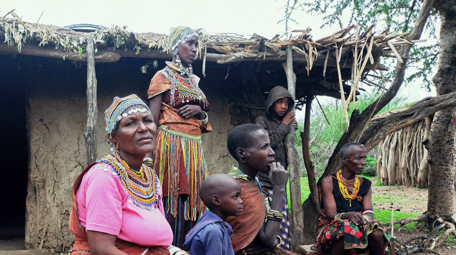

```{r setup, include=FALSE}
knitr::opts_chunk$set(echo = FALSE, message = FALSE, warning = FALSE, comment = "")
```

We are living in an era where technological advances are common. According to @AgingInPlace, over the years, technology has revolutionized our world and daily lives. Technology plays an important role in society today. Technology’s advancements  has given us brand new devices in recent decades, like smartwatches, tablets, and voice assistant devices. These devices have provided quicker ways to communicate through instant messaging apps and social media platforms. It has also made possible to do things like transfer money instantly and make purchases for everything from clothes, food delivery, groceries, furniture, and more. It affects the way people learn, study, work, communicate, think and reflect [@Bbntimes2022]. Technology has changed how we entertain ourselves, meet each other, and consume all types of media contents. 


```{r kids, fig.cap="Kids at the Lake Eyasi basin", out.width="100%"}

knitr::include_graphics(path = "../images/iraqw_kids.png")

```


Despite the advancement in technology and the merit its brought to the society in recent years, there’s a downside to technology, as it has been linked to mental health issues. Emerging scientific evidence indicates that frequent digital technology use has a significant impact—both negative and positive—on brain function and behavior. Potential harmful effects of extensive screen time and technology use include heightened attention-deficit symptoms, impaired emotional and social intelligence, technology addiction, social isolation, impaired brain development, and disrupted sleep [@Small2020]. However, specific programs, videogames, and other online tools may provide mental exercises that activate neural circuitry, improve cognitive functioning, lessen anxiety, increase restful sleep, and offer other brain-health benefits. 

Research on the brain physiology and the consequences of digital technology has draw attention to the society. Recent studies tell that screen exposure disrupts sleep, which can have a negative effect on cognition and behavior. Daily touch-screen use among infants and toddlers  shows to negatively impact sleep onset, sleep duration, and nighttime awakenings. Computer and phone light-emitting diode (LED) screens emit slow wave, blue light that interferes with circadian rhythms. Exposure to LED versus non-LED screens has shown to produce changes in *melatonin* levels and sleep quality, and such exposure decreases cognitive performance. Some of these novel tools includes for assessment of mental wellbeing and cognition and analysis of the EEG signal include machine learning and Artificial Intelligence frameworks that will automatically process and analyse the ECG signal and help us understand diverse human physiological, mental and cognitive phenotypes and their social and environmental determinants.


The [Nelson Mandela African Institution of Science and Technology](https://nm-aist.ac.tz) in collaboration with [SapienLab](https://sapienlabs.org) of USA seeks to understand brain diversity and mental health of the population across the country. The research focuses to measure, monitor and understand the interplay between life experience, brain physiology and cognitive and mental health outcomes across the globe, and put forth insights that can help manage it for more positive outcomes. It is a cross disciplinary approach toward understanding the influence of environment on brain and the relationship between brain and mental outcomes. It also work to develop new tools for measurement, new approaches to signal processing and large-scale data acquisition and analytics [@SapienLabs2022]. 


To have a glimpse of the effect of technology across the society, the study will explore in depth the life and brain physiology of the Datoga and Hadzabe tribes, which have retained their life style for over 3000 years. The DATOGA known as the Mang'ati in Swahili, are a pastoralist Nilotic people of Manyara, Arusha, Mara, and Singida Region of Tanzania [@enwiki]. Datoga are also a Nilotic group of people and they live around Lake Eyasi as well as in the semi-arid areas of Tanzania [@Focus2022]. Markings on faces around the eyes (Picha \@ref(fig:datoga)) is among the key identity of the Datoga. 


```{r datoga, fig.cap="Marking around the eyes on woman faces of Datoga in Mangora, Karatu", out.width="100%"}
knitr::include_graphics(path = "../images/datoga.png")

```


The women among the Datoga wear jewelry and also traditional hides and the married women wear a garment which has thin leather strips (Figure \@ref(fig:cloth)). The jewelry is made from copper, beads or iron which is used to make necklaces, bracelets and earrings among others.

```{r cloth, fig.cap="Cloth weary of Datoga women in Mangora, Karatu", out.width="100%"}


```

The second tribe that is HADZABE OR TINDIGA, which are also called *bushmen* simply because they live in the forest. Their language resembles the languages of click of the bushmen in the south of the kalahari. This tribe usually live in small family nuclei. Most of them have never visited the doctor neither have gone to the school. Their way of life is characteristically nomadic---regularly move from one place to another in the same area. Unlike the Datoga that are pastolarist, Hadzabe rely on hunting and gathering of fruits, roots and barks of trees for food. They hunt with arches and poisoned arrows that they build themselves and they are recognized by their great aim. They usually hunt small animals as mice, hares, Dik-Dik and baboon, and big animals as kudu or buffalos. They build their houses with branches, and cover them with skins of animals (Figure \@ref(fig:hadzabe)), and during the rainy season they move to the caves in the mountains.


```{r hadzabe, fig.cap="Hadzabe nuclei in the upper hill of Lake Eyasi in Mangora, Karatu", out.width="100%"}
knitr::include_graphics(path = "../images/hadzabe.png")

```


## References
