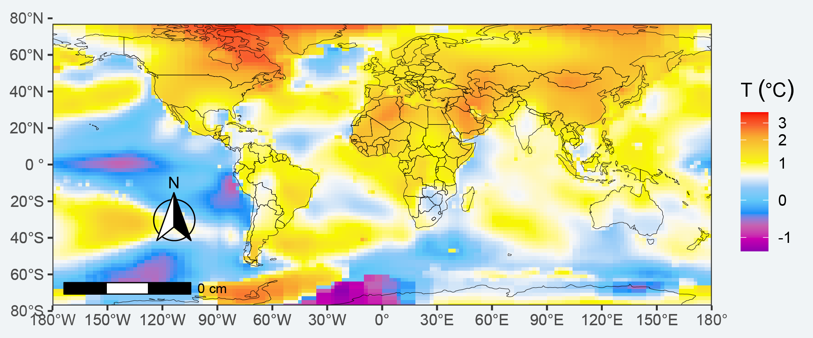
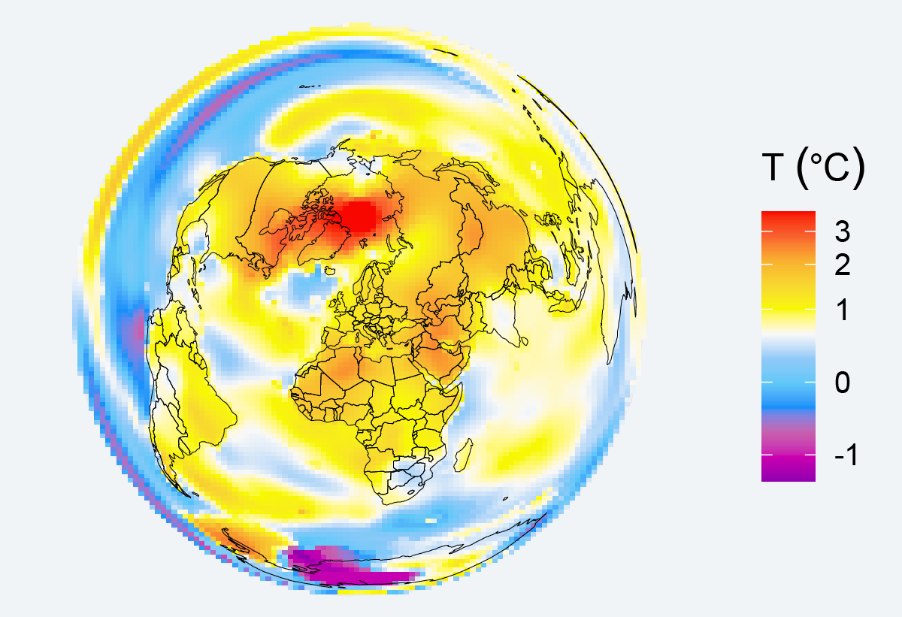

```{r setup, include=FALSE}
knitr::opts_chunk$set(echo = TRUE, message = FALSE, warning = FALSE, comment = "")
```

## Introduction

Maps are used in a variety of fields to express data in an appealing and interpretive way. Map making — the art of cartography — is an ancient skill that involves communication, intuition, and an element of creativity. Current solutions for creating maps usually involves GIS software, such as ArcGIS, QGIS, which allow to visually prepare a map.

On the other hand, R, a free and open-source software development environment (IDE) that is used for computing statistical data and graphic in a programmable language, for a long time has had a relatively simple mechanism, via the maps package, for making simple outlines of maps and plotting lat-long points and paths on them. More recently, R has developed advanced spatial capabilities and can be used to draw maps programmatically. Some of the packages include **sf**, **stars**, **raster**, **sp**, **ggspatial**, **ggplot2**, **tmap**, **ggmap**, **rgdal**, and **rgeos**, R has been acquiring much of the functionality of traditional GIS packages (like ArcGIS, etc). 

In this post,  I will briefly show hot make a simple flat map with a combination of **ggplot2** and **ggspatial** packages. First, let's us load the packages we need for this task


```{r}
require(sf)
require(tidyverse)
require(ggspatial)


require(tmap)
## basemap shapefile from tmap package
data("World")
```

## Color codes
R allows us  to specify a color in several ways in this chunk below, I use the hex codes to specify the color code gradient that will later used to show the gradient of temperature. 

```{r}
mycolor3 = c("#9000B0", "#C900B0", "#C760AF", "#1190F9", "#60C8F8", "#90C9F8", "#F8F8F8", "#F8F800",  "#F8D730", "#f8b030", "#f8602f", "#f80000")
```

## Dataset 
We will use the NASA GISTEMP V4 dataset that combine NOAA GHCN meteorological stations and ERSST ocean temperature to form a comprehensive long record of temperature variability of the earth surface. The dataset contains monthly temperature values from 1880 to present, which is widely used to monitor the weather and climate at regional and global scale. Rather than using absolute temperature values, the dataset  uses anomaly obtained by using base period (1951-1980). This dataset is open and free to download as netCDF format file at [GISTEMP](https://data.giss.nasa.gov/gistemp/). I have processed the file and we can load as the csv file here. Lets' load the package in our session

```{r}
global = read_csv("../data/temperature_lss_global_1990_2020_2021.csv")

global %>% FSA::headtail()
```


We need to create a Raster* object from a dataframe with longitude, latitude and z values. This can be faciliated with `rasterFromXYZ` function in **raster** package.  longitude  and latitude represent spatial coordinates and must be on a regular grid. If the resolution is not supplied, it is assumed to be the minimum distance between longitude and latitude coordinates, but a resolution of up to 10 times smaller is evaluated if a regular grid can otherwise not be created. Thus, we first create a raster layer of global temperature. This raster layer we will use for mapping the distribution of temperature in flat and spherical maps. 


```{r }
temperature = global %>% filter(year == 2021)

temperature.raster = temperature %>% 
  select(lon,lat,temperature) %>% 
  raster::rasterFromXYZ(crs = 4326)
```

The function `coord_sf` allows to deal with the coordinate system, which includes both projection and extent of the map. By default, the map will use the coordinate system of the first layer that defines one (i.e. scanned in the order provided), or if none, fall back on WGS84 (latitude/longitude, the reference system used in GPS).  Since our dataset use WGS84, it will draw flatten map of temperature shown in figure \@ref(fig:temperature)

```{r, eval=FALSE}

ggplot()+
  ggspatial::layer_spatial(data = temperature.raster)+
  ggspatial::layer_spatial(data = World, fill = NA)+
  coord_sf(xlim = c(-180,180), ylim = c(-70,70), crs = 4326)+
  scale_fill_gradientn(colours = mycolor3, 
                       trans = scales::modulus_trans(p = .1),
                       name = expression(T~(degree*C))) +
  theme_bw(base_size = 12)+
  theme(axis.title = element_blank(), 
        plot.background = element_rect(fill = "#f0f4f6", colour = NA), 
        panel.background = element_rect(fill = "#f0f4f6", colour = NA), 
        legend.background = element_rect(fill = "#f0f4f6", colour = NA))+
  metR::scale_x_longitude()+
  annotation_scale(location = "bl", width_hint = 0.25) +
  annotation_north_arrow(location = "bl", which_north = "true", 
        pad_x = unit(0.75, "in"), pad_y = unit(0.5, "in"),
        style = north_arrow_fancy_orienteering)
```


```{r  temperature, fig.width=8, fig.cap="Flatten Global land and sea surface temperature anomaly for a year 2021 compared to to the 1950-1980 average", echo=FALSE, out.width="100%", echo=FALSE,fig.align="center"}

# ggsave("index.en_files/figure-html/temperature0.svg")


```


Suppose we want to change change shape of the map to spherical and to visualize in details areas with high temperature for the year 2021, we simply alter the `coord_sf` function. Using the argument `crs`, it is possible to override this setting, and project on the fly to any projection. This can be achieved using any valid PROJ4 string (here, the European-centric ETRS89 Lambert Azimuthal Equal-Area projection) was used to map temperature values in spherical shape figure \@ref(fig:temperature1).


```{r , eval=FALSE}

europe = "+proj=laea +lat_0=52 +lon_0=10 +x_0=4321000 +y_0=3210000 +ellps=GRS80 +units=m +no_defs"

ggplot()+
  ggspatial::layer_spatial(data = temperature.raster)+
  ggspatial::layer_spatial(data = World, fill = NA)+
  coord_sf(crs = europe) +
  scale_fill_gradientn(colours = mycolor3, na.value = NA,
                       trans = scales::modulus_trans(p = .1),
                       name = expression(T~(degree*C))) +
  theme_bw(base_size = 12)+
  theme(axis.title = element_blank(), 
        plot.background = element_rect(fill = "#f0f4f6", colour = NA), 
        panel.background = element_rect(fill = "#f0f4f6", colour = NA), 
        legend.background = element_rect(fill = "#f0f4f6", colour = NA))


```


```{r temperature1, fig.width=8, fig.cap="Spherical Global land and sea surface temperature anomaly for a year 2021 compared to to the 1950-1980 average", echo=FALSE, out.width="50%", echo=FALSE,fig.align='center'}

# ggsave("index.en_files/figure-html/temperature1-1.svg", width = 4, height = 4)


```

Suppose we are interested in adjusting the projection and make africa popup. first we define the location, and then project coordinates from WGS84 to the specified, for instance in this case to UTM zone 37

```{r}
points = tibble(x = 55, y = -75) %>% 
  st_as_sf(coords = c("x", "y"), crs = 4326) %>% 
  st_transform(32737)

points %>% st_bbox()


```


Then use the easting (xmin) and northings (ymin) values into the projection and specify it in the coord_sf and map figure \@ref(fig:temperature2)

```{r eval=FALSE}

africa = "+proj=laea +lat_0=52 +lon_0=10 +x_0=957039 +y_0=1614295 +ellps=GRS80 +units=m +no_defs"

ggplot()+
  ggspatial::layer_spatial(data = temperature.raster)+
  ggspatial::layer_spatial(data = World, fill = NA)+
  coord_sf(crs = africa) +
  scale_fill_gradientn(colours = mycolor3, na.value = NA,
                       trans = scales::modulus_trans(p = .1),
                       name = expression(T~(degree*C))) +
  theme_bw(base_size = 12)+
  theme(axis.title = element_blank(), 
        plot.background = element_rect(fill = "#f0f4f6", colour = NA), 
        panel.background = element_rect(fill = "#f0f4f6", colour = NA), 
        legend.background = element_rect(fill = "#f0f4f6", colour = NA))


```


```{r temperature2, fig.width=8, fig.cap="Spherical Global land and sea surface temperature anomaly for a year 2021 compared to to the 1950-1980 average", echo=FALSE, out.width="50%", echo=FALSE,fig.align="center"}

# ggsave("index.en_files/figure-html/temperature2-1.svg", width = 4, height = 4)


```

