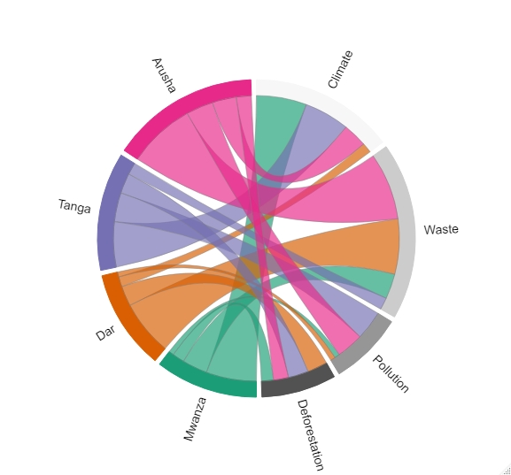

```{r setup, include=FALSE}
knitr::opts_chunk$set(echo = TRUE, message = FALSE, warning = FALSE, eval = FALSE, comment = "")

```


A *chord* diagram is a graphical representation of the data in a matrix's interrelationships. The data is arranged in a radial pattern around a circle, with the relationships between the data points commonly depicted as arcs linking the dots (Wikipedia). Each entity is represented by a fragment on the outer part of the circular layout. Then, arcs are drawn between each entities. The size of the arc is proportional to the importance of the flow.

Using the htmlwidgets interface architecture, the **chorddiag** package in R allows us to build interactive chord diagrams using the JavaScript visualization library **D3** from within R.

We'll look at how to make interactive chord diagrams in this blog post. You can view how many regions from each environmental challenges are by hovering over the arcs for each region/section below.


```{r}
require(tidyverse)
require(viridis)
require(chorddiag)  #devtools::install_github("mattflor/chorddiag")

```


We create a dataframe of four regions in Tanzania with with a count of people responded to the causes of environmental challenges

```{r}
regions = data.frame(Mwanza = c(50, 25, 5, 12),
                      Dar = c(10, 55, 5, 20),
                      Tanga = c(45,12,29, 20),
                      Arusha = c(24,67,27,15))

regions
```

We then convert the region data frame to matrix and assign the corresponding environmental challenges as row names

```{r}
regions = as.matrix(regions)
row.names(regions) = c("Climate", "Waste", "Pollution", "Deforestation")
```

We can then plot the chord diagram

```{r}
regions %>% chorddiag(type = "bipartite", 
                      showTicks = F, 
                      groupnameFontsize = 14, 
                      groupnamePadding = 10, 
                      margin = 90, showGroupnames = T)
```

Sometimes we might not be interested with default colors and wish to define our own colors. Since we have four groups, let's define the color and use it to make similar plot but with a different flavour from the color

```{r}
groupColors <- c("#000000", "#FFDD89", "#957244", "#F26223")

regions %>% chorddiag(type = "bipartite", 
                      showTicks = F, 
                      groupColors = groupColors,
                      groupnameFontsize = 14, 
                      groupnamePadding = 10, 
                      margin = 90, 
                      showGroupnames = T)
```


Chord diagrams can also be used to show transition matrices. Let's pretend that each row in the dummy data below represents the number of customers each company has this year. Let's imagine, though, that some of your clients decide to switch firms next year (shown in the columns). You may hover your mouse over the visualization to check which companies are losing the most clients and which are keeping the most.
```{r}
df = data_frame(`Company A` = c(800, 200, 100, 50, 140, 200, 140),
                `Company B` = c(100, 2000, 300, 400, 50, 0, 290),
                `Company C` = c(200, 500, 4000, 80, 120, 320, 600),
                `Company D` = c(500, 200, 300, 5000, 250, 140, 450),
                `Company E` = c(600, 300, 150, 600, 6000, 30, 0),
                `Company F` = c(500, 400, 100, 300, 250, 4500, 140),
                `Company G` = c(300, 50, 0, 150, 600, 250, 7000))
df
```


```{r}
df = as.matrix(df)
row.names(df) = c(colnames(df))
```


```{r}
chorddiag(data = df, 
          type = "directional", 
          showTicks = F, 
          groupnameFontsize = 14, 
          groupnamePadding = 10, 
          margin = 90)

```


## Bonus
The bonus in this post is the chord diagram using dataset of estimates of global bilateral migration Flows by Gender between 1960 and 2015 published by [Gui J. Abel](https://onlinelibrary.wiley.com/doi/abs/10.1111/imre.12327)

```{r}
# Load dataset from github
data <- read.table("https://raw.githubusercontent.com/holtzy/data_to_viz/master/Example_dataset/13_AdjacencyDirectedWeighted.csv", header=TRUE)
```


```{r}
# short names
colnames(data) <- c("Africa", "East Asia", "Europe", "Latin Ame.",   "North Ame.",   "Oceania", "South Asia", "South East Asia", "Soviet Union", "West.Asia")
rownames(data) <- colnames(data)
```


```{r}

mycolor <- viridis(10, alpha = 1, begin = 0, end = 1, option = "D")

data %>% 
  as.matrix() %>% 
  chorddiag(type = "directional", 
            showTicks = F,  groupColors = mycolor,
            groupnameFontsize = 14, 
            groupnamePadding = 10, 
            margin = 90)
```


```{r, echo=FALSE, fig.cap="leo"}

```


